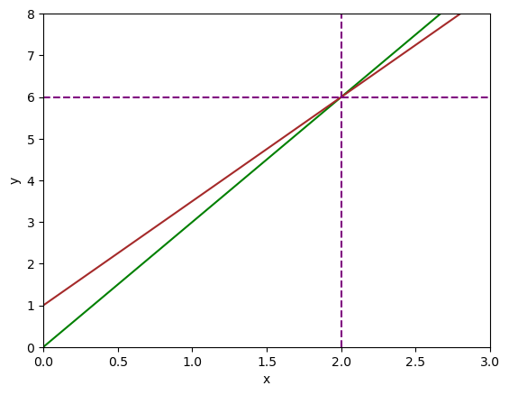

# Segment1 : Data Structure for Algebra

## What is Linear algebra is 


```python
import numpy as np
import matplotlib.pyplot as plt
```


```python
t = np.linspace(0,40,1000) #start , finish, n points
```


```python
d_r = 2.5 * t #Distance travelled by robber: d = 2.5t
```


```python
d_s = 3 * (t-5) #Distace travelled by sheriff: d = 3(t - 5)
```


```python
fig, ax = plt.subplots()
plt.title('A Bank Robber Caught')
plt.xlabel('time (in minutes)')
plt.ylabel('distance (in km)')
ax.set_xlim([0, 40])
ax.set_ylim([0, 100])
ax.plot(t, d_r, c='green')
ax.plot(t, d_s, c='brown')
plt.axvline(x=30, color='purple', linestyle='--')
_ = plt.axhline(y=75, color='purple', linestyle='--')

```


    

    


### Visualizing linear system


```python
# In the substitution ex, the two equarions in the system are:-
# y = 3x
# -5 + 2y = 2, the second equation can be rearranged to isolated y
```


```python
import numpy as np
import matplotlib.pyplot as plt
```


```python
x = np.linspace(-10,10,1000) # start, finish , n point
```


```python
y1 = 3 * x
```


```python
y2 = 1 + (5 * x) / 2
```


```python
fig, ax = plt.subplots()
plt.xlabel ('x')
plt.ylabel ('y')
ax.set_xlim([0,3])
ax.set_ylim([0,8])
ax.plot(x, y1, c = 'green')
ax.plot(x, y2, c = 'brown')
plt.axvline(x = 2, color = 'purple', linestyle = '--')
_ = plt.axhline(y = 6, color = 'purple', linestyle = '--')
```


    

    


```python
# solving linear system with elimination method
# 2x - 3y = 15 and 4x + 10y = 14
import numpy as np
import matplotlib.pyplot as plt
```


```python
x = np.linspace(-10,10,1000)
```


```python
y1 = - 5 + (2*x) / 3
```


```python
y2 = (7-2*x) / 5
```


```python
fig, ax = plt.subplots()
plt.xlabel('x')
plt.ylabel('y')

#add x and y axes
plt.axvline(x = 0,color = 'lightgray')
plt.axhline(y = 0,color = 'lightgray')

ax.set_xlim([-2, 10])
ax.set_ylim([-6, 4])

ax.plot(x,y1,c = 'green')
ax.plot(x,y2,c = 'brown')

plt.axvline(x = 6,color = 'purple',linestyle = '--')
_ = plt.axhline(y = -1,color = 'purple',linestyle = '--')
```


    

    

